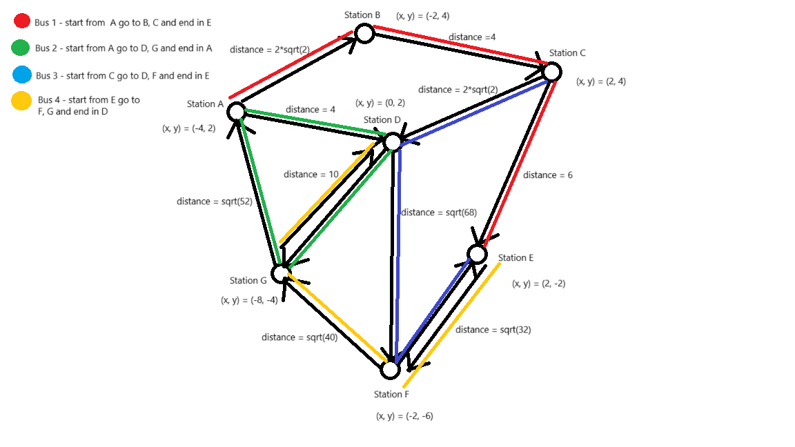

# 🚀 Navigation System with Floyd-Warshall Algorithm

This project implements a **navigation system** using **Java, MyBatis, and MySQL**, designed to compute the **shortest and alternative paths** between stations using the **Floyd-Warshall algorithm**. The system allows users to interact via the **console**, inputting station names and selecting a transport mode (**CAR** or **BUS**) to determine the most efficient route.

## 📌 Features

- **CRUD Operations for Stations & Roads**  Users can list, add, update, and delete stations and roads stored in the MySQL database.

- **Dynamic Graph Construction**  The system **automatically** updates an adjacency matrix (graph) based on data from the **stations** and **roads** tables.

- **Shortest Path Calculation (Floyd-Warshall Algorithm)**  Computes the shortest route between two stations based on real distances from the database. The distances between stations are computed using **Euclidean distance**, utilizing the `x` and `y` coordinates stored in the database.

- **Multi-Mode Transport Support**  Users can choose between **CAR** and **BUS**, with the system considering both **one-way** and **two-way** roads based on the database configuration.

## 📊 Graph Representation

The navigation system's road network is represented as a weighted graph. The edges correspond to roads connecting stations, and the **weights** (distances) are computed using the **Euclidean distance formula**.

Here are visual representations of the network:

### 📌 Graph with Bus Routes and Distances



### 📌 Graph with Euclidean Distances


## 🗄️ Database Structure

The database consists of two main tables: **stations** and **roads**.

### 📍 Stations Table

The `stations` table stores information about all available stations, including their coordinates for distance calculation.

```sql
CREATE TABLE IF NOT EXISTS stations (
    station_id INT AUTO_INCREMENT PRIMARY KEY,
    name       VARCHAR(50) NOT NULL,
    x_coord    DOUBLE NOT NULL,
    y_coord    DOUBLE NOT NULL
);
```

### 🛣️ Roads Table

The `roads` table stores connections between stations, defining the mode of transport (**CAR** or **BUS**) and whether the road is **one-way** or **two-way**.

```sql
CREATE TABLE IF NOT EXISTS roads (
    road_id         INT AUTO_INCREMENT PRIMARY KEY,
    from_station_id INT NOT NULL,
    to_station_id   INT NOT NULL,
    mode            ENUM('CAR','BUS') NOT NULL,
    is_one_way      BOOLEAN NOT NULL,
    bus_color       VARCHAR(20) DEFAULT NULL,
    FOREIGN KEY (from_station_id) REFERENCES stations(station_id),
    FOREIGN KEY (to_station_id)   REFERENCES stations(station_id)
);
```

- **One-way roads**: Travel is only allowed in one direction.
- **Two-way roads**: Travel is allowed in both directions.

The system dynamically retrieves station and road data to construct the adjacency matrix for the **Floyd-Warshall algorithm**.

## 🛠️ Technologies Used

- **Java 17**
- **MyBatis**
- **MySQL**
- **Lombok**
- **Maven**

## 👤 Project Structure

```
📦 Floyd-Warshall-Algorithm
├── 📂 src/main/java/com/solvd
│   ├── 📅 controller      # Handles user input and application flow
│   ├── 📅 service         # Business logic and MyBatis integration
│   ├── 📅 dao             # Data Access Objects for MyBatis
│   │   ├── 📅 implementation  # DAO Implementations
│   ├── 📅 mapper          # MyBatis SQL mappings
│   ├── 📅 models          # POJO classes for Station and Road
│   ├── 📅 algorithms      # Floyd-Warshall Algorithm Implementation
│   ├── 📅 utils           # Graph management
│   ├── 📅 config          # MyBatis configuration
├── 📂 src/main/resources
│   ├── 📄 mybatis-config.xml  # MyBatis configuration file
│   ├── 📄 database.properties # Database credentials
│   ├── 📄 database_initialization.sql # SQL script to set up tables
├── 📄 pom.xml             # Maven dependencies
├── 📄 README.md           # Project documentation
```

## 🌟 Setup Instructions

### 🔗 1. Clone the Repository

```sh
git clone https://github.com/SzczypekJ/Floyd-Warshall-Algorithm.git
cd Floyd-Warshall-Algorithm
```

### 🛠️ 2. Set Up the Database

1. Open **MySQL Workbench** or any SQL client.
2. Open the file `src/main/resources/database_initialization.sql`.
3. Copy the SQL statements from the file.
4. Paste and execute them in **MySQL Workbench** to create the database and tables.
5. Update the database configuration in `database.properties`:
   ```
   url=jdbc:mysql://localhost:3306/navigation_db
   username=your_username
   password=your_password
   driver=com.mysql.cj.jdbc.Driver
   ```

### ▶️ 3. Initialize the Project

To initialize the project, use one of the following commands:

```sh
mvn clean compile
```

or

```sh
mvn clean install
```

### ▶️ 4. Run the Application

- Open your **IDE** (IntelliJ, Eclipse, or VS Code with Java support).
- Locate the **MainApp.java** file inside `src/main/java/com/solvd/`.
- Run the `MainApp` class.

## 🔄 Usage Instructions

### 1️⃣ Work with the Database

- **List** all stations and roads.
- **Add**, **update**, or **delete** stations and roads.

### 2️⃣ Compute Shortest Route

- Enter **start station name** and **destination station name**.
- Select **transport mode**: `CAR` or `BUS`.
- The system will compute the shortest and alternative paths (if available).

### 3️⃣ Exit

- Type `Exit` to close the application.

---

### 💡 Contributors

- **Jakub Szczypek** – **Project Lead, Database Design, DAOs, MVC Pattern & Logic Implementation**
- **Liberty** – **Graph Construction**
- **Siarhei** – **Floyd-Warshall Algorithm Implementation**
